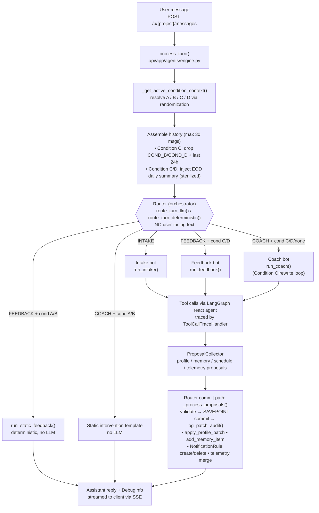

# Current Flow Sketch: Bots, Orchestrator, and Tool Calls

> **Status:** Descriptive sketch of the conversation engine **as implemented in the
> latest code**. For the authoritative architecture contract see
> [current-architecture.md](current-architecture.md) and the
> [AGENTS.md](../AGENTS.md) "State, authority, and write-path rules" section.

---

## TL;DR

- **Yes, there is an orchestrator — the Router.** It decides which specialist bot
  handles each turn and emits **no user-facing text**. It is also the **single
  writer** to both stores (UserProfile + Memory).
- Specialist bots (**Intake**, **Feedback**, **Coach**) generate the user-facing
  reply and may only **propose** patches via tools. The Router validates and commits.
- For control conditions **A / B** the LLM bots are bypassed entirely and replaced
  by deterministic scripts/templates (no LLM, no patch writes).

---

## End-to-end turn diagram

---

## The orchestrator (Router)

| Aspect | Detail |
|--------|--------|
| Where | [api/app/agents/routing.py](../api/app/agents/routing.py) — `route_turn_llm()` / `route_turn_deterministic()` |
| Decides | Which specialist handles the turn: `INTAKE`, `FEEDBACK`, or `COACH` |
| User-facing text | **None** — routing only |
| LLM routing | Structured output against `RouteDecision`, system prompt `prompts/router_system.txt` |
| Safety coercion | Any non-specialist route is coerced to `COACH`; `STATIC_TEMPLATE` / `STATIC_FEEDBACK` are **engine-set markers**, never emitted by the Router |
| Write authority | **Single writer** — only the Router commits to UserProfile and Memory via `_process_proposals()` in [api/app/agents/proposals.py](../api/app/agents/proposals.py) |

Deterministic routing rules (fallback when no router LLM is supplied):

1. Missing `prompt_anchor` or `preferred_time` → **INTAKE**
2. Conversation state is `FEEDBACK` → **FEEDBACK**
3. Otherwise → **COACH**

---

## The bots

| Bot | Entry | Responsibility | Tools available | Can write? |
|-----|-------|----------------|-----------------|------------|
| **Router** | `routing.py` | Route turn + commit all patches | — (validates proposals) | **Yes — only writer** |
| **Intake** | [intake.py](../api/app/agents/intake.py) `run_intake()` | Onboarding / required profile fields | `propose_profile_patch`, `propose_memory_patch`, `propose_schedule_nudge`, `propose_delete_schedule`, `list_schedules` | Propose only |
| **Feedback** | [feedback.py](../api/app/agents/feedback.py) `run_feedback()` | Sterile telemetry/outcome extraction (cond C/D) | proposal tools + `record_daily_telemetry` (feedback-only) | Propose only |
| **Coach** | [coach.py](../api/app/agents/coach.py) `run_coach()` | Normal conversation + nudges | proposal tools + `list_schedules` | Propose only |

All three specialists are LangGraph `create_react_agent` instances built by
`_create_specialist_agent()` ([specialists.py](../api/app/agents/specialists.py)) and
invoked through `run_agent()` ([runner.py](../api/app/agents/runner.py)), which wires
in the `ToolCallTraceHandler` ([tool_trace.py](../api/app/agents/tool_trace.py)) so
every tool call is captured into `DebugInfo`.

---

## Tool inventory

Proposal tools are created per turn by `make_proposal_tools()` in
[api/app/tools/proposal_tools.py](../api/app/tools/proposal_tools.py) and bound to a
fresh `ProposalCollector`. They **do not write** — they append to the collector for
the Router to validate and commit.

| Tool | Args | Effect (after Router validation) | Available to |
|------|------|----------------------------------|--------------|
| `propose_profile_patch` | `patch`, `confidence`, `message_ids`, `quotes`, `source_bot` | `apply_profile_patch()` on UserProfile | All specialists |
| `propose_memory_patch` | `items`, `confidence`, `message_ids`, `quotes`, `source_bot` | `add_memory_item()` per item | All specialists |
| `propose_schedule_nudge` | `topic`, `time`, `confidence`, `message_ids`, `source_bot` | Create `NotificationRule` + state | All specialists |
| `propose_delete_schedule` | `rule_id`, `confidence`, `message_ids`, `source_bot` | Deactivate rule + cancel pending tasks | All specialists |
| `record_daily_telemetry` | `state_updates` | Merge into today's `DailyInterventionLog.extracted_state` | **Feedback only** |
| `list_schedules` | — (scoped to membership) | Read-only list of active schedules | Intake, Coach |

The Router's commit step enforces the permission matrix (allowed fields per source
bot), evidence spans (cited `message_ids`), and confidence thresholds, then commits
each proposal inside a **SAVEPOINT** with an entry in `patch_audit_log`.

---

## Condition matrix (A / B / C / D)

The active condition is resolved per turn from the participant's `Participation` row
via `get_daily_condition()` and changes which path runs:

| Feature | A | B | C | D |
|---------|---|---|---|---|
| **Intake** | LLM agent | LLM agent | LLM agent | LLM agent |
| **Feedback** | Static script — no LLM, no patches | Static script — no LLM, no patches | LLM agent + proposal tools | LLM agent + proposal tools |
| **Coach** | Static template — no LLM, no patches | Static template — no LLM, no patches | LLM agent + Condition-C rewrite loop | LLM agent |
| **Cross-day memory** | None | None | EOD summary injected (sterilized) | EOD summary injected (sterilized) |
| **History filter** | Full | Full | Exclude `COND_B`/`COND_D` + last 24h | Full |

**Condition C rewrite loop** ([coach.py](../api/app/agents/coach.py)): Coach output is
checked by `contains_condition_c_framing()`
([condition_filters.py](../api/app/services/condition_filters.py)); if it contains
if/then, commitment, promise, reward, or bet language it is regenerated (up to 3
attempts) to strip the forbidden framing. The static A/B feedback script lives in
[feedback_script.py](../api/app/services/feedback_script.py) and **never** proposes
patches.

---

## Out of band: scheduled nudges

The diagram above covers the **interactive chat turn**. Scheduled/push nudges run on a
separate path via the notification worker
([notification_worker.py](../api/app/worker/notification_worker.py)), which generates
condition-specific nudges (static template for A/B, framed/unframed LLM for C/D),
persists the assistant `Message`, and attempts best-effort Web Push. See the
"Notification Worker" and "4-Condition Randomized Block Experiment" sections of
[current-architecture.md](current-architecture.md) for that flow.
